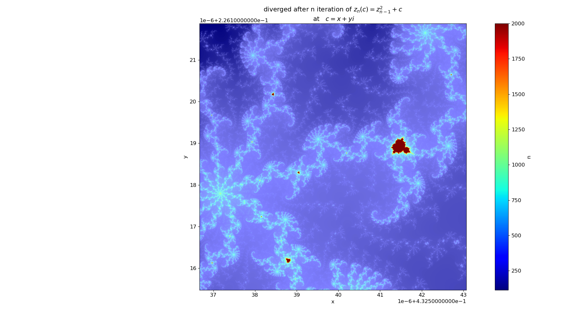

# Mandelbrot
A python script to represent a part of the mandelbrot set for a given region of the complex plane.

The Mandelbrot set is made up of all complex numbers **c** for which the following iterative function remains bound:


The code sets up an N X N matrix of equidistantly sampled points from a squer region of the complex plane, with side length L centered around the point 
c0 = x + y * i

The basic Mandelbrot iteration is then performed on each point T number of times. for all interesting regions of the Mandelbrot set 

run this in your command line to preduce the image shown bellow

```console
foo@bar:~$ python Mandelbaecker.py 0.432539867562512  0.226118675951765 3.2e-6
foo
```


